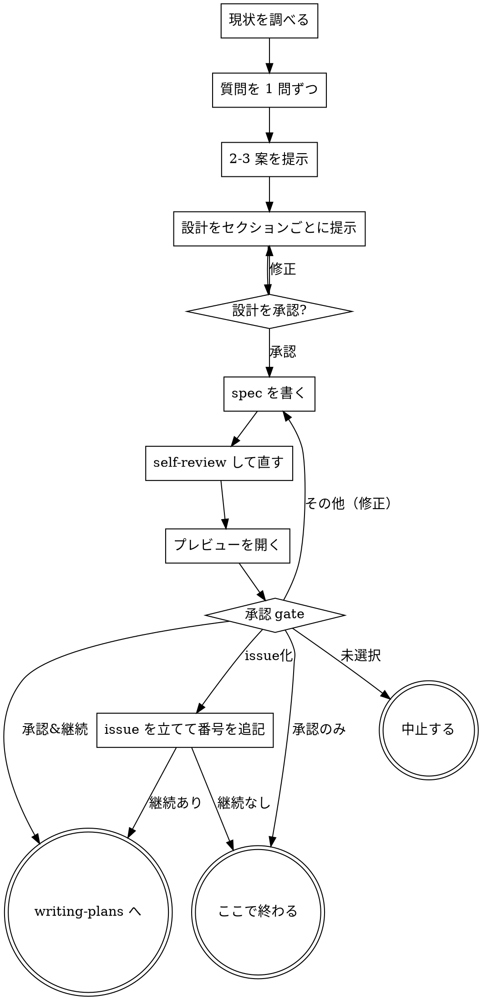

{{ includeTemplate (printf "agent-skills/_runtime/%s.md" .tool) . }}

# アイデアを設計に詰める

対話でアイデアを設計と spec に落とす。まずプロジェクトの現状を把握し、次に質問を 1 問ずつ投げて詰める。何を作るのか分かった時点で設計を提示し、承認を取る。

<HARD-GATE>
設計を提示してユーザーが承認するまで、実装スキルの起動・コードの記述・プロジェクトのスキャフォールド・その他の実装行為を一切行わない。どれだけ単純に見えるプロジェクトでも例外はない。
</HARD-GATE>

## 「単純すぎて設計は要らない」は成立しない

todo リストでも 1 関数のユーティリティでも設定変更でも、すべてこの手順を通す。単純に見えるプロジェクトこそ、検証していない前提が最大の手戻りを生む。設計そのものは短くてよい（本当に単純なら数文で足りる）。ただし提示して承認を取ることは省略しない。

## チェックリスト

各項目を todo にして、順に消化する。

1. **プロジェクトの現状を調べる** — ファイル、docs、直近のコミット
2. **質問を 1 問ずつ投げる** — 目的・制約・成功条件を理解する
3. **2-3 案を提示する** — トレードオフと推奨を添える
4. **設計を提示する** — セクションごとに合意を取る
5. **spec を書く** — `_cellfusion/specs/YYYY-MM-DD-<topic>-design.md`
6. **spec を self-review する** — placeholder / 内部矛盾 / スコープ / 曖昧さ
7. **プレビューを開く** — 実行環境に応じた別の端末で spec を開く
8. **承認 gate** — [ask-user] で承認を取り、選ばれた処理を実行する
9. **writing-plans を起動する**（承認 gate で継続を選んだ場合のみ）

## 進行

**終端は writing-plans の起動**。frontend-design やその他の実装スキルをここから起動してはならない。brainstorming の次に起動するスキルは writing-plans だけ。

## アイデアを理解する

- 先にプロジェクトの現状を見る（ファイル、docs、直近のコミット）
- 細かい質問に入る前にスコープを見積もる。依頼が独立した複数のサブシステムを含むなら（例「チャットとファイル保管と課金と分析を持つプラットフォームを作る」）、その場で指摘する。分解が必要なプロジェクトの細部を詰めても無駄になる
- 単一の spec に収まらない規模なら、まずサブプロジェクトへの分解を手伝う。独立した塊は何か、互いにどう関係するか、どの順で作るか。そのうえで最初のサブプロジェクトだけを通常の流れで詰める。サブプロジェクトごとに spec → plan → 実装のサイクルを回す
- 適正な規模なら、質問を 1 問ずつ投げて詰める
- 可能なら選択式にする。自由記述でもよい
- **1 メッセージ 1 質問**。話題が広いなら複数の質問に分ける
- 目的・制約・成功条件の理解に集中する

## 案を探る

- 異なる 2-3 案をトレードオフ付きで提示する
- 推奨案を先頭に置き、なぜそれを推すかを書く
- YAGNI を徹底する。どの案からも不要な機能を削る

## 設計を提示する

- 何を作るか分かったと思えた時点で設計を提示する
- 各セクションの分量は複雑さに合わせる。単純なら数文、込み入っていれば 200-300 語まで
- セクションごとに「ここまでで合っているか」を確認する
- アーキテクチャ、コンポーネント、データフロー、エラー処理、テストを扱う
- 腑に落ちない点があれば前に戻ってよい

## 分離と明確さのための設計

- システムを、それぞれ 1 つの目的を持ち、明確なインターフェースで繋がり、独立に理解・テストできる単位に割る
- 各単位について「何をするか」「どう使うか」「何に依存するか」に答えられること
- 内部を読まずに単位の役割が分かるか。consumer を壊さずに内部を変えられるか。答えが no なら境界の切り方を見直す
- 小さく境界の明確な単位は Claude 自身にとっても扱いやすい。一度に context へ載る量のコードのほうが推論も編集も確実になる。ファイルが大きくなってきたら、たいてい責務を持ちすぎている合図

## 既存コードベースでの作業

- 変更を提案する前に現状の構造を調べる。既存のパターンに従う
- 作業対象のコードに、この作業に影響する問題があるなら（肥大化したファイル、曖昧な境界、絡まった責務）、その改善を設計に含める。触っているコードを良くするのは普通の開発者の仕事の一部
- 無関係なリファクタリングは提案しない。今回の目的に資する範囲に留める

## spec を書く

- 書く前に `~/.agents/skills/_shared/scripts/cellfusion-workdir` を実行する。`_cellfusion/` を作り、自己無視の `.gitignore` を置く。global の gitignore が無い環境（新しいマシン、他人の環境、CI）ではこれが唯一の無視の根拠になるので省略しない
- 合意した設計を `_cellfusion/specs/YYYY-MM-DD-<topic>-design.md` に書く
  - プロジェクト側の CLAUDE.md に置き場所の指定があればそちらを優先する
- 日付はその日の実際の日付を使う。相対表現（「今日」「先週」）は書かない

## spec の self-review

書き終えたら新しい目で見直す。

1. **placeholder 走査** — 「TBD」「TODO」、書きかけの節、曖昧な要件が残っていないか。あれば直す
2. **内部整合** — 節どうしが矛盾していないか。アーキテクチャの記述と機能の記述が食い違っていないか
3. **スコープ** — 単一の実装プランに収まるか。収まらないなら分解が要る
4. **曖昧さ** — 2 通りに読める要件がないか。あれば片方に決めて明記する

見つけたその場で直す。再レビューは不要。

{{ includeTemplate "agent-skills/_preview-tab.md" . }}

{{ includeTemplate "agent-skills/_approval-gate.md" (merge (dict "artifact" "spec" "nextLabel" "実装プラン" "issue" true) .) }}

## 実装への引き継ぎ

- writing-plans スキルを起動して実装プランを作る
- 他のスキルは起動しない。次は writing-plans だけ

## よくある言い訳

| 言い訳 | 実際 |
|---|---|
| 「今回は単純だから設計は省く」 | 単純に見える案件ほど前提が検証されていない。設計は短くてよいが、提示と承認は省かない |
| 「先にコードを見ないと設計できない」 | 現状調査はチェックリストの 1 番目。調査と実装は別 |
| 「ユーザーの意図は明らかだ」 | 明らかだと思った意図が食い違うのが最も高くつく。1 問投げて確かめる |
| 「spec を書くのは大げさだ」 | spec は次の writing-plans の入力。無いとプランが推測で埋まる |
| 「承認は取れている雰囲気だ」 | gate は明示的な選択で取る。雰囲気は承認ではない |
| 「プレビューは開かなくても伝わる」 | 開くのは gate の一部。読むかどうかをユーザーに選ばせない |
| 「自分が書いた内容だから読み直さなくてよい」 | プレビューは編集可で開く。手編集はファイルにしか残らない |
