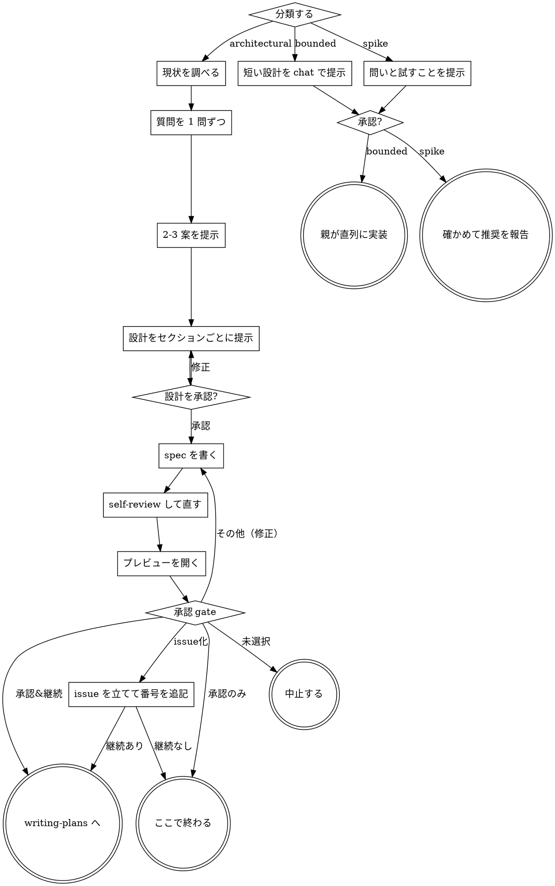

{{ includeTemplate (printf "agent-skills/_runtime/%s.md" .tool) . }}

# アイデアを設計に詰める

対話でアイデアを設計と spec に落とす。まずプロジェクトの現状を把握し、次に質問を 1 問ずつ投げて詰める。何を作るのか分かった時点で設計を提示し、承認を取る。

<HARD-GATE>
設計を提示してユーザーが承認するまで、実装スキルの起動・コードの記述・プロジェクトのスキャフォールド・その他の実装行為を一切行わない。どれだけ単純に見えるプロジェクトでも例外はない。
</HARD-GATE>

## 3 つの経路

最初の質問を投げる前に、依頼を次の 3 つに分類し、分類を声に出して宣言する。ユーザーが分類を
覆せるようにする。宣言の例は「既存の処理への範囲の定まった変更なので bounded とみなす。spec は
書かず、短い設計をこの場で提示する」である。

- **spike** — 実現性を確かめる問いである。「できるか」「可能か」「雑でよい」という依頼が当たる。
  出力は答えであってコードではない。問いと試すことを 2-3 文で提示して承認を取り、正しさが許す
  限り安く確かめる。確かめる作業は子に委譲する。試す方針が 1 つなら `researcher` を 1 つ呼び、
  複数の方針を比べるなら MAD の `spike` recipe を使う。spec ファイルも plan も作らない。作った
  ものは使い捨てと明記して報告する
- **bounded** — このリポジトリに既にある処理への、範囲の定まった変更である。フラグの追加、
  小さいエンドポイント、1 ファイルの修正が当たる。**変える処理をいま読めることが条件である。**
  アプリの種類が分かることでは足りない。変える処理がここに無いなら bounded ではない。必要な
  質問をし、短い設計を chat で提示して止まる。承認の後に実装へ入る。spec ファイルも plan も
  作らない
- **architectural** — 新しいプロジェクト、新しいサブシステム、コンポーネントの組み方を作り直す
  変更、他が依存するインターフェースを変える変更である。全工程を通る

**2 つの経路で迷ったら重いほうを取る。** 分類は一方通行である。作業の途中で隠れていた複雑さが
見つかったら、そこで止めてその旨を伝え、経路を上げる。下げることはしない。

**どの経路でも承認は取る。** 作業量は経路で変わるが、承認は変わらない。

## 「単純すぎて設計は要らない」は成立しない

todo リストでも 1 関数のユーティリティでも設定変更でも、すべてこの手順を通す。単純に見えるプロジェクトこそ、検証していない前提が最大の手戻りを生む。設計そのものは短くてよい（本当に単純なら数文で足りる）。ただし提示して承認を取ることは省略しない。

## チェックリスト

分類を宣言してから、自分の経路の各項目を todo にして順に消化する。

**spike:**

1. **現状を調べる** — 問いを組み立てられる範囲で
2. **問いと試すことを提示する** — 2-3 文
3. **承認を取る** — 同意が取れればよい
4. **確かめる** — 子に委譲する。正しさが許す限り安く
5. **結果を報告する** — 推奨として書く。作ったものは使い捨てと明記する

**bounded:**

1. **現状を調べる** — ファイル、docs、直近のコミット。子に委譲する
2. **質問を 1 問ずつ投げる** — 効く質問だけ
3. **短い設計を chat で提示する** — 方針、触るファイル、テスト方法
4. **承認を取る** — 明示的な同意を待って止まる。提示と着手を同じ発言で行わない
5. **実装する** — 親が直列に実装する。`executing-plans` と同じ作法にし、合意した設計を要件と
   する。plan ファイルは作らない

**architectural:**

1. **現状を調べる** — ファイル、docs、直近のコミット。子に委譲する
2. **質問を 1 問ずつ投げる** — 目的・制約・成功条件を理解する
3. **2-3 案を提示する** — トレードオフと推奨を添える
4. **設計を提示する** — セクションごとに合意を取る
5. **spec を書かせる** — 子に委譲する
6. **spec を判定させる** — 子に委譲する。上限は 2 ラウンド
7. **プレビューを開く** — 実行環境に応じた別の端末で spec を開く
8. **承認 gate** — [ask-user] で承認を取り、選ばれた処理を実行する
9. **writing-plans を起動する**（承認 gate で継続を選んだ場合のみ）

## 進行

**終端は経路で決まる。** architectural では、次に起動するスキルは writing-plans だけである。
frontend-design やその他の実装スキルをここから起動してはならない。bounded では、承認の後に親が
直列に実装する。plan ファイルは作らない。spike では、推奨の報告が終端である。

## アイデアを理解する

- 先にプロジェクトの現状を調べる（ファイル、docs、直近のコミット）。調査は子に委譲する。観点が
  1 つなら `researcher` を 1 つ呼び、観点を分けたいなら MAD の `research` recipe を使う。子には
  何を知りたいかと、読ませたいファイルの絶対パスを渡す。親は調査本文を会話へ転記せず、成果物の
  絶対パスを受け取る
- 細かい質問に入る前にスコープを見積もる。依頼が独立した複数のサブシステムを含むなら（例「チャットとファイル保管と課金と分析を持つプラットフォームを作る」）、その場で指摘する。分解が必要なプロジェクトの細部を詰めても無駄になる
- 単一の spec に収まらない規模なら、まずサブプロジェクトへの分解を手伝う。独立した塊は何か、互いにどう関係するか、どの順で作るか。そのうえで最初のサブプロジェクトだけを通常の流れで詰める。サブプロジェクトごとに spec → plan → 実装のサイクルを回す
- 適正な規模なら、質問を 1 問ずつ投げて詰める
- 可能なら選択式にする。自由記述でもよい
- **1 メッセージ 1 質問**。話題が広いなら複数の質問に分ける
- 目的・制約・成功条件の理解に集中する

## 案を探る

- 異なる 2-3 案をトレードオフ付きで提示する
- 推奨案を先頭に置き、なぜそれを推すかを書く
- YAGNI を徹底する。どの案からも不要な機能を削る

## 設計を提示する

- 何を作るか分かったと思えた時点で設計を提示する
- 各セクションの分量は複雑さに合わせる。単純なら数文、込み入っていれば 200-300 語まで
- セクションごとに「ここまでで合っているか」を確認する
- アーキテクチャ、コンポーネント、データフロー、エラー処理、テストを扱う
- 腑に落ちない点があれば前に戻ってよい

## 分離と明確さのための設計

- システムを、それぞれ 1 つの目的を持ち、明確なインターフェースで繋がり、独立に理解・テストできる単位に割る
- 各単位について「何をするか」「どう使うか」「何に依存するか」に答えられること
- 内部を読まずに単位の役割が分かるか。consumer を壊さずに内部を変えられるか。答えが no なら境界の切り方を見直す
- 小さく境界の明確な単位は Claude 自身にとっても扱いやすい。一度に context へ載る量のコードのほうが推論も編集も確実になる。ファイルが大きくなってきたら、たいてい責務を持ちすぎている合図

## 既存コードベースでの作業

- 変更を提案する前に現状の構造を調べる。既存のパターンに従う
- 作業対象のコードに、この作業に影響する問題があるなら（肥大化したファイル、曖昧な境界、絡まった責務）、その改善を設計に含める。触っているコードを良くするのは普通の開発者の仕事の一部
- 無関係なリファクタリングは提案しない。今回の目的に資する範囲に留める

## spec を書く

- 書く前に `~/.agents/skills/_shared/scripts/agent-docs-dir specs` を実行する。保存先を作って
  絶対パスを 1 行で返す。保存先は `~/docs/<owner>/<repo>/specs/` で、リポジトリの作業ツリーの
  外にある
- spec を書くのは子である。MAD の `spec` recipe で `spec-author` を呼ぶ。呼び方は
  `multi-agent-development` スキルが持つ
- 子へ渡すのは、合意した設計、既知の制約、調査成果物の絶対パス、spec の書き出し先である。
  書き出し先は `agent-docs-dir specs` が返したディレクトリの `YYYY-MM-DD-<topic>-design.md` と
  する。プロジェクト側の CLAUDE.md に置き場所の指定があればそちらを優先する
- 日付はその日の実際の日付を使う。相対表現（「今日」「先週」）は書かない
- 親は spec の本文を書かない。会話へ転記もしない。受け取るのは正規 spec の絶対パスである
- 子が `decisionRequestPath` を返したら、親が [ask-user] でユーザーへ渡し、回答を `decision.md` に
  書いて子を再開する。親が子に代わって判断しない

## spec を判定する

判定するのも子である。`reviewer` が spec を読み、`PASS` か `FAIL` と findings を返す。判定の基準は
`reviewer` の role プロンプトが持つ。親は spec の本文を読んで良し悪しを決めない。

`FAIL` が返ったら、指摘の絶対パスを添えて `spec-author` を再度起動する。1 回の再起動と 1 回の
再判定で 1 ラウンドとする。**上限は 2 ラウンドである。**

上限に達しても `PASS` にならない場合、親が残った指摘を 1 件ずつ裁定する。裁定は 3 つに振り分ける。

- **指摘が誤っている、または議論の余地がある** — 理由を添えて退ける。理由を run state の
  `parent_decision` に記録する
- **本物だが、今回の spec の範囲外である** — spec の「未解決事項」に入れさせる
- **本物で、かつ設計の前提を崩している** — 止める。指摘と、衝突している設計の記述を並べて
  ユーザーに報告する

**裁定は上限に達したときだけ行う。** ループを早く終わらせるための裁定は先回りである。
黙って捨てることは禁止する。

{{ includeTemplate "agent-skills/_preview-tab.md" . }}

次の承認 gate は architectural 経路のものである。spike と bounded は spec ファイルを作らないので、
チェックリストの「承認を取る」の通り、chat で提示した問いか設計に対して承認を取る。

{{ includeTemplate "agent-skills/_approval-gate.md" (merge (dict "artifact" "spec" "nextLabel" "実装プラン" "issue" true) .) }}

## 実装への引き継ぎ

- writing-plans スキルを起動して実装プランを作る
- 他のスキルは起動しない。次は writing-plans だけ

## よくある言い訳

| 言い訳 | 実際 |
|---|---|
| 「今回は単純だから設計は省く」 | 単純に見える案件ほど前提が検証されていない。設計は短くてよいが、提示と承認は省かない |
| 「先にコードを見ないと設計できない」 | 現状調査はチェックリストの 1 番目。調査と実装は別 |
| 「ユーザーの意図は明らかだ」 | 明らかだと思った意図が食い違うのが最も高くつく。1 問投げて確かめる |
| 「spec を書くのは大げさだ」 | spec は次の writing-plans の入力。無いとプランが推測で埋まる |
| 「承認は取れている雰囲気だ」 | gate は明示的な選択で取る。雰囲気は承認ではない |
| 「プレビューは開かなくても伝わる」 | 開くのは gate の一部。読むかどうかをユーザーに選ばせない |
| 「自分が書いた内容だから読み直さなくてよい」 | プレビューは編集可で開く。手編集はファイルにしか残らない |
| 「bounded と呼べば spec を省ける」 | 省くために分類を選ぶこと自体が迷いである。迷ったら重いほうを取る |
| 「このアプリの種類は分かるので bounded だ」 | bounded はリポジトリの状態で決まる。変える処理をいま読めなければ architectural である |
| 「途中で大きくなったが、もう終わりかけなので分類は変えない」 | 隠れていた複雑さは経路を上げる。止めてその旨を伝える |
| 「spike が動いたのでコードを残す」 | spike の出力は答えである。コードを残すのは別の依頼なので、分類からやり直す |
