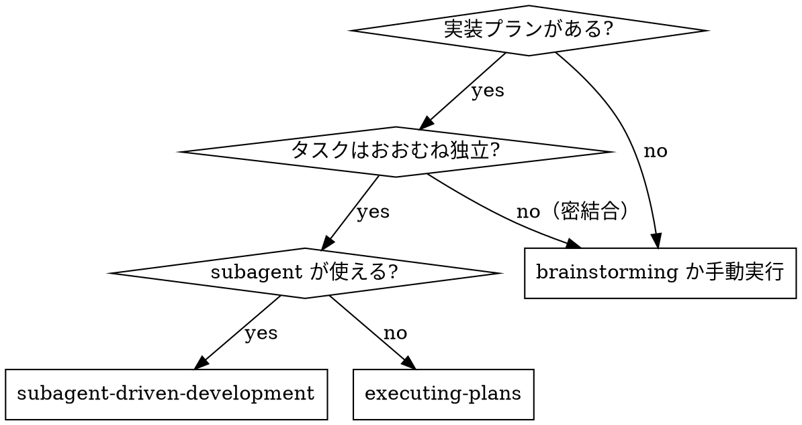

{{ includeTemplate (printf "agent-skills/_runtime/%s.md" .tool) . }}

# Subagent-Driven Development

タスクごとに新しい implementer subagent を dispatch し、そのたびにタスクレビュー（spec 準拠 + コード品質）を通し、最後にブランチ全体のレビューを 1 回行う。

**なぜ subagent か**: タスクを、隔離された context を持つ専門エージェントに委譲する。指示と文脈を正確に組み立てることで、彼らは焦点を保ち、そのタスクに成功する。**彼らはあなたのセッションの context や履歴を継承しない**。必要なものだけをあなたが構築する。これはあなた自身の context を調整作業のために温存することでもある。

**中核**: タスクごとに新しい subagent ＋ タスクレビュー（spec + 品質）＋ 最後の広いレビュー ＝ 高い品質と速い反復。

**進行の実況**: ツール呼び出しの間に書くのは短い 1 行までにする。記録は ledger とツール結果が持つ。

**止まらずに実行する**: タスクの合間にユーザーへ確認を挟まない。プランの全タスクを止まらずに実行する。止まってよいのは、解決できない BLOCKED、進行を本当に妨げる曖昧さ、全タスク完了のいずれか。「続けてよいか」の確認や途中経過の要約はユーザーの時間を奪う。プランの実行を頼まれたのだから、実行する。

## いつ使うか



## Setup

**隔離ワークスペースを用意する**。using-git-worktrees を起動して worktree を作るか、既にある worktree を確認する。ユーザーの明示的な同意なしに main / master 上で実装を始めない。

**ledger を用意する**。会話の記憶は compaction を越えない。実セッションで、自分の位置を見失った controller が完了済みのタスク列をまるごと再 dispatch した事故が観測されている。進捗は todo だけでなく ledger ファイルで追う。

- プランごとに 1 つの workspace を持つ。スキル開始時に `~/.agents/skills/subagent-driven-development/scripts/sdd-workspace PLAN_FILE` を実行する。git 管理外のディレクトリ（`<repo-root>/_cellfusion/sdd/<plan-basename>/`）のパスが出力される。**このプランの**成果物（ledger、brief、report、review package）はすべてそこに置く。別プランのディレクトリは読むことも書くこともしない
- `<workspace>/progress.md` を確認する。1 行目が自分のプランファイルを指しているなら、`Task <N>: complete` の行があるタスクは**完了済み**。再 dispatch せず、その行が無い最初のタスクから再開する。最後の行が fix ラウンドで終わっているタスクはループの途中なので、次のラウンドから再開する。1 行目が別のプランを指す ledger は他人の進捗なので、そのまま置いて自分のものを新規に作る
- ledger は 1 行目に素性を書いて作る: `# SDD ledger — plan: <plan file path>`
- ledger は復旧地図である。そこに書かれたコミットは、あなたの context がそれを作った記憶を失っても git に存在する。compaction 後は自分の記憶より ledger と `git log` を信じる
- `git clean -fdx` は `_cellfusion/` を消す（git 管理外の作業領域なので）。workspace は `git log` から復旧できるが、plan と spec は git のどこにも無いので復旧できない
- **plan は worktree の外にあることがある**。plan は untracked なのでブランチに乗らず、main チェックアウトの `_cellfusion/plans/X.md` は worktree の中には現れない。scripts にもレビュアーにも plan は絶対パスで渡す

**プランを 1 回読む**。文脈と Global Constraints を頭に入れ、タスクごとに todo を作る。

**波を計算する**。`~/.agents/skills/subagent-driven-development/scripts/task-waves PLAN_FILE` を実行し、同時に走らせてよいタスクの組を得る（下の「波ごとの並行実行」）。エラーで終了したらプランの依存宣言が壊れているので、実行を始めずにユーザーへ報告する。

**Task 1 を dispatch する前に、プランを 1 度だけ矛盾検査する**。

- 互いに矛盾するタスク、または Global Constraints と矛盾するタスク
- プランが明示的に指示しているが、レビュー基準では欠陥とされるもの（何も assert しないテスト、ロジックブロックの逐語的重複）

見つけたものは**まとめて 1 回**ユーザーに提示する。各指摘と、それを指示しているプランの記述を並べ、どちらが優先するかを聞く。これは実行開始前に行う。発見のたびに割り込むのではない。検査が空なら何も言わずに進む。実装してみて初めて表面化する矛盾は、レビューループが拾う。

## エージェントの選択

役割ごとにエージェントを用意してある。dispatch のたびにモデルを選ぶのではなく、**エージェントを選ぶ**。

| エージェント | tier | 役割 |
|---|---|---|
| `sdd-implementer` | work | 実装タスク全般 |
| `sdd-implementer-think` | think | 設計判断が要るタスク、fix ラウンド 4-5 |
| `sdd-task-reviewer` | work | タスク単位レビュー（spec 準拠 + 品質） |
| `sdd-re-reviewer` | fast | fix ラウンドのスコープ限定再レビュー |
| `sdd-final-reviewer` | deep | ブランチ全体の最終レビュー |

**エスカレーション**: 設計判断が要るタスク、および fix ラウンド 4-5 では、`sdd-implementer` の代わりに `sdd-implementer-think` を dispatch する。両者の指示は同一で、モデルだけが上位になる。dispatch 時にモデルを渡して昇格させない。渡せるツールと渡せないツールがあるためである。

**ターン数は単価に勝つ**。実時間と context のコストは subagent が何ターン掛けたかで決まる。安いモデルは多段の作業でターンを 2-3 倍使い、結局高くつく。ここで実装と通常レビューの床を work tier にしているのはそのため。

## 実行経路

### sdd-run 経路（前提が揃えば既定）

次の 2 つが揃っているなら、役割ごとにエンジンを選べる `sdd-run` 経路を使う。
実装を codex、レビューを claude というように分けられる。対応は
`~/.agents/agent-defs/routing.json` が持つ。

```bash
test -r ~/.agents/agent-defs/routing.json && command -v claude && command -v codex
```

**前提が揃っているとき、この節が他のすべての経路に優先する。下の経路の節は読まない。**

プラン 1 本の実行全体を `sdd-run` が回す。**あなたが呼ぶのはこの 1 コマンドだけである。**

```bash
~/.agents/skills/subagent-driven-development/scripts/sdd-run --plan <プランの絶対パス>
```

`sdd-run` が持つもの: run ID と registry、波の計算、worktree の作成と依存セットアップ
（worktrunk）、波の中のタスクの並行起動、ledger への記帳、`git merge --no-ff`、
worktree とブランチの片付け、中断からの再開。

**worktree はあなたが作らない。** worktrunk が作り、herdr には登録しない
（子エージェントが herdr の状態管理と通知に載らないようにするため）。

返り値の `status` ごとにあなたがやること:

| status | 対応 |
|---|---|
| `COMPLETE` | 全タスクが完了した。最終レビューへ進む |
| `NEEDS_ATTENTION` | `attention` の各要素を 1 件ずつ裁定する（下表）。裁定してから `--run-id <runId>` で再開する |
| `CONFLICT` | マージが衝突した。「独立」の判断が外れた証拠である。**自分で解消しない。** 衝突したブランチと該当タスクをユーザーに報告する |
| `BAD_PLAN` | プランの依存宣言が壊れている。実行を始めずにユーザーへ報告する |
| `BAD_ARGS` / `AGENT_FAILED` | `detail` を読んで原因を潰してから再実行する |

`attention` の各要素の `status`:

| status | 対応 |
|---|---|
| `NEEDS_CONTEXT` | 足りない情報を brief か報告ファイルに足して、`--run-id` で再開する |
| `NEEDS_HUMAN` | plan-mandated な指摘。指摘とプランの記述を並べてユーザーに判断を仰ぐ |
| `CAP_REACHED` | `open` を 1 件ずつ裁定する（park / BLOCKED）。「ブレーカー」の節に従う |
| `BLOCKED` | 「報告を処理する」の 4 分類でブロッカーを評価する |
| `AGENT_FAILED` | `stage` を見る。`precommit` なら commit 前検査に落ちている。`backend` なら CLI 側の問題。worktree は残っているので中を見る |

`minor` と `cannotVerify` は ledger に書かれている。`cannotVerify` は
**ledger に記録され、run が返った後にまとめて解消する**。sdd-run は全波を 1 回の呼び出しで回し切る。

**失敗したタスクの worktree は残る。** `attention[].workdir` の絶対パスを報告する。

herdr 管理下（`$HERDR_ENV` が `1`）なら、workspace として開いて人が中に入れる。

```bash
herdr worktree open --cwd <feature worktree> --path <task worktree> --no-focus
```

`<task worktree>` には `attention[].workdir` を渡す。それ以外の環境では、
パスを報告するだけにする。

routing が codex を指しているのに codex の CLI が PATH に無い場合、勝手に claude へ
落とさない。[ask-user] で「claude だけで続行するか、止めるか」を聞く。

{{ if ne .tool "claude" }}
### 手動経路（既定）

この環境に [deterministic-loop] は無い。下の「タスクループ」を controller が自分で回す。ラウンド数を数えるのも、ラウンド 4-5 で `sdd-implementer-think` へ切り替えるのも、Minor をループに入れないのも、上限で止めるのも、すべてあなたの仕事である。**規則は下の「タスクループ」が正**であり、そこから外れない。

冒頭の対応表が [resume-subagent] を「継続する機構は無い」としている環境では、fix ラウンド 1-3 も新しい implementer を立て、報告ファイルで記憶を引き継ぐ。
{{ else }}
`sdd-run` の前提が揃わなければ、タスクループは [deterministic-loop] 経路で回す。前提が揃っているときは上の `sdd-run` 経路が優先するので、この先は読まない。

### [deterministic-loop] 経路（sdd-run の前提が揃わないときの既定）

`workflows/sdd-task.js` が 1 タスク分の「実装 → タスクレビュー → fix ループ（最大 5 ラウンド）」を決定的に回す。1 タスクにつき 1 回呼ぶ。

**このスキルが [deterministic-loop] の利用を指示しているので opt-in の条件は満たしている。** ユーザーに改めて確認しない。

なぜ workflow か:

- **fix ループが決定的になる**。ラウンド数、4-5 でのモデル昇格、Minor をループに入れないこと、上限で止めること — すべて制御フローになり、controller の記憶に依存しなくなる
- **`effort` を dispatch 時に指定できる**。エージェント定義の tier に縛られず、プランに完成したコードが載っている転記だけのタスクは低い effort で回せる
- **verdict が構造化される**。レビュー結果は JSON スキーマで検証されるので、散文を読み違えて判断を誤ることがない
- **controller の context が汚れない**。dispatch プロンプトも報告も workflow 側に留まり、返るのは判断に要る要約だけ

workflow 内でできないこと:

- **implementer を resume できない**。`agent()` は毎回新しいエージェントなので、fix ラウンド 1-3 も「新しい implementer ＋ 報告ファイル」になる。持続的な記憶は報告ファイルが担う
- **人に質問できない**。implementer は質問の代わりに NEEDS_CONTEXT を返し、workflow はそこで止まって controller に返す

呼び出し方: Workflow ツールの `scriptPath` に
`~/.config/claude/skills/subagent-driven-development/workflows/sdd-task.js`
を渡し、`args` に次を入れる。

| キー | 中身 |
|---|---|
| `plan` | プランファイルのパス |
| `taskNumber` / `taskName` | タスク番号と名前 |
| `briefPath` | `~/.agents/skills/subagent-driven-development/scripts/task-brief` が出力したパス |
| `reportPath` | brief に合わせた報告ファイルのパス（`task-N-report.md`） |
| `base` | dispatch 前に記録した `git rev-parse HEAD` |
| `globalConstraints` | プランの Global Constraints をそのままの値で |
| `context` | このタスクがプロジェクトのどこに位置するかの 1 行 |
| `interfaces` | 先行タスクで決まったインターフェースと決定事項 |
| `resolutions` | brief の曖昧点についてのあなたの解決 |
| `parkedPointers` | この領域に park されている指摘へのポインタ（あれば） |
| `effort` | 既定は `high`。転記だけのタスクのみ `low` |
| `workdir` | 波で並行するときだけ。このタスク専用 worktree の絶対パス。渡す場合は `plan` / `briefPath` / `reportPath` も絶対パスにする |

返り値の `status` ごとに controller がやること:

| status | 対応 |
|---|---|
| `COMPLETE` | `cannotVerify` を 1 件ずつ自分で解消してから ledger に完了行を書く |
| `CAP_REACHED` | `open` を 1 件ずつ裁定する（park / BLOCKED）。「ブレーカー」の節に従う |
| `NEEDS_HUMAN` | plan-mandated な指摘。指摘とプランの記述を並べてユーザーに判断を仰ぐ |
| `NEEDS_CONTEXT` | 足りない情報を `resolutions` に足して再実行する |
| `BLOCKED` | 「報告を処理する」の 4 分類でブロッカーを評価する |
| `AGENT_FAILED` | `stage` を見て、同じ引数で再実行するか、原因を潰してから再実行する |
| `BAD_ARGS` | 引数の不備。`detail` を読んで直してから再実行する |

`minor` と `outOfScope` は ledger に先送りとして積み、最終レビューへ渡す。

⚠️ 確認できなかった要件（`cannotVerify`）を解消した結果、本当の穴だと分かった場合は、
同じスクリプトを `mode: 'fix'`、`head: <現在の HEAD>`、`findings: [{severity, summary, location}]`
で呼び直す。実装を飛ばして fix ループだけが回る。

### args の渡し方

`args` は**オブジェクトのまま渡す**。自分で JSON 文字列に変換しない。

ただし Claude Code 2.1.220 の実測では、オブジェクトを渡しても script 側には **JSON 文字列で届く**（ドキュメントは verbatim と書いているが、そうならない）。両スクリプトは冒頭でこれを正規化しているので、呼び出し側は気にしなくてよい。

**スクリプトを編集するとき、素の `args.x` を直接参照する形に戻してはならない。** 全プロパティが `undefined` になり、実装エージェントが要件不明のまま走ってトークンだけ消える。実際にこの事故が起きている。正規化済みの `input.x` を使う。

必須 args が欠けている場合はエージェントを起動する前に `BAD_ARGS` で返る。

### workflow のデバッグ

**スクリプトの挙動だけを確かめる**（エージェントを起動しない、無料）:

```bash
node ~/.config/claude/skills/subagent-driven-development/workflows/test-workflows.mjs
```

`agent` / `phase` / `log` を差し替えた fake ランタイムでスクリプト本体を実行し、生成される dispatch プロンプトと戻り値を検証する。スクリプトを編集したら必ず走らせる。

**実際の run を調べる**: 実行記録は `~/.config/claude/projects/<project>/<session>/workflows/wf_*.json` に残る。

| 見るもの | コマンド |
|---|---|
| args の到着型と中身 | `jq -r '.args \| type' wf_*.json` / `jq -r '.args' wf_*.json` |
| 実行されたスクリプト全文 | `jq -r '.script' wf_*.json`（手元のファイルと diff する） |
| 戻り値・状態 | `jq -r '{status, result, logs}' wf_*.json` |
| エージェントごとの結果 | `subagents/workflows/<runId>/journal.jsonl` |

実行中の run は `/workflows` で見る。

### 手動経路（フォールバック）

[deterministic-loop] が無い環境では、下の「タスクループ」を controller が自分で回す。この経路では fix ラウンド 1-3 で [resume-subagent] を使い、元の implementer を再開できる。
{{ end }}

## 波ごとの並行実行

### sdd-run 経路の場合

`sdd-run` 経路では、波の計算・worktree・並行起動・マージ・片付けをすべて `sdd-run` が行う。
**あなたはこの節の手順を実行しない。** 何が起きるかを知っておくために読む。

`~/.agents/skills/subagent-driven-development/scripts/task-waves PLAN_FILE` がプランの
`Depends on:` を読み、同時に走らせてよいタスクの組を出す。

```
wave 1: 1
wave 2: 2 3
wave 3: 4
```

**worktree を切る条件は「同時に書くエージェントの数」である。** タスク数ではない。

```
波のタスクが 2 つ以上
  または implementer が claude（書き込み範囲を縛る CLI 機能が無い）
    昇格先の sdd-implementer-think も implementer として数える
  または feature worktree が clean でない
→ タスクごとに worktree を作る
```

1 タスクだけの波は、上のどれにも当たらなければ現在の作業ツリーで実行する。
ブランチも merge も要らない。**その間、あなたも人間もその作業ツリーを触らない。**

worktree は worktrunk が作る。`.env` のコピーと依存インストールは
リポジトリ側の `.config/wt.toml` の `pre-start` フックが同期で行う。
herdr には登録しないので、workspace もタブも増えない。

片付けは `git merge --no-ff` → `wt remove --no-delete-branch` → `git branch -d` の順で行う。
`wt remove` にブランチ削除を任せない（判定の基準が default branch であり、
feature branch にマージしただけでは消えない）。

**マージが衝突したら `sdd-run` は止まる。** 「独立」の判断が外れた証拠である。
プランの `Depends on:` か `Files:` が実態と合っていない。衝突の内容と該当タスク番号を
ユーザーに報告し、どう直すかを聞く。自分で解消して先へ進まない。

**波の中で一部が失敗したら `sdd-run` は波を閉じずに返す。** 失敗したタスクの worktree は残る。
裁定してから `--run-id` で再開する。完了済みのタスクは再 dispatch されない。

### sdd-run 経路でない場合: deterministic-loop / 手動経路

`sdd-run` の前提が揃わないなら、claude は [deterministic-loop] 経路、codex と opencode は手動経路でこの手順を使う。
ツール名ではなく `sdd-run` の前提が揃うかどうかで分かれる。

worktree を作るのは、同時に書くエージェントが 2 つ以上ある波だけである。
**作った worktree では必ず `wt hook pre-start` を同期実行する。** これを飛ばすと実装エージェントが
`node_modules` も `.env` も無い作業ツリーに着地する。

`~/.agents/skills/subagent-driven-development/scripts/task-waves PLAN_FILE` がプランの
`Depends on:` を読み、同時に走らせてよいタスクの組を出力する。

```
wave 1: 1
wave 2: 2 3
wave 3: 4
```

### 未設定経路の波の回し方

**1 タスクだけの波**: worktree を作らず、現在の作業ツリーで実行する。ブランチも merge も要らない。
ただし dispatch 前に作業ツリーと index が clean であることを確認し、実行中はあなたも人間もそこを触らない。

**2 タスク以上の波**:

1. 波の base を記録する（`git rev-parse HEAD`）。波の全タスクがここから分岐する
2. タスクごとに worktree を作る
   ```bash
   git worktree add "<repo-root>/.worktrees/task-<N>" -b "sdd/task-<N>" <wave-base>
   ```
   リポジトリに `.config/wt.toml` があるなら、worktree ごとにセットアップを走らせる。
   ```bash
   (cd "<repo-root>/.worktrees/task-<N>" && wt hook pre-start)
   ```
   **`pre-` を使う。** `post-` は背後で走って即座に戻るので、実装エージェントが依存の入っていない作業ツリーでテストを回すことになる。
3. タスクごとに brief を作り、worktree の絶対パスを `workdir` として実装エージェントへ渡す
4. 全タスクの完了通知が返るまで待つ
5. 完了したタスクを順にマージする
   ```bash
   git merge --no-ff "sdd/task-<N>"
   ```
6. worktree とブランチを片付ける
   ```bash
   git worktree remove "<repo-root>/.worktrees/task-<N>"
   git branch -d "sdd/task-<N>"
   ```

**マージが衝突したら止める。** 「独立」の判断が外れた証拠である。プランの `Depends on:` か `Files:` が実態と合っていない。
衝突の内容と該当タスク番号をユーザーに報告し、自分で解消して先へ進まない。

**波の中で一部が失敗したら、失敗したタスクの worktree は片付けない。** 人が中を確認して解決してから波を閉じる。

### ledger

波の境界を記録する。タスク単位の行はこれまでどおり。

```
Wave 2: tasks 3,4 parallel (worktrees .worktrees/task-3, .worktrees/task-4, base 1c7b7a6)
Task 3: complete (commits 1c7b7a6..a50c3f7, review clean)
Task 4: complete (commits 1c7b7a6..7733827, review clean)
Wave 2: merged 3,4 -> 9b2e1c4
```

マージ行の無い波は閉じていない。compaction 後に再開したときは、残っている worktree がその印になる。

## タスクループ

{{ if eq .tool "claude" }}
[deterministic-loop] 経路では、この節の 1〜4 が `sdd-task.js` の中で自動化される。**規則そのものはこの節が正**であり、[deterministic-loop] はそれを実装したものである。controller が自分で担うのは Setup、[deterministic-loop] への引数の用意、返り値の処理、ledger、裁定、人間への確認である。
{{ else }}
この節の 1〜4 を controller が自分で回す。[deterministic-loop] が無いので、ラウンド数を数え、上限で止め、裁定するのはすべてあなたである。
{{ end }}

dispatch プロンプトに貼ったものと、subagent が返したものは、以降このセッションが続く限りあなたの context に residue として残り、毎ターン読み直される。**成果物はファイルで受け渡す。**

### 1. implementer を dispatch する

dispatch の前に BASE（`git rev-parse HEAD`）を記録する。review package と fix ラウンドの diff がこれを必要とする。

- **task brief**: `~/.agents/skills/subagent-driven-development/scripts/task-brief PLAN_FILE N` を実行する。タスク本文が固有名のファイルに書き出され、そのパスが出力される。brief が要件の唯一の情報源になるように dispatch を組む
- **dispatch プロンプトに入れるもの**（これだけ）:
  1. このタスクがプロジェクトのどこに位置するかの 1 行
  2. brief のパス。「まずこれを読むこと。これがあなたの要件で、使う値はここに書いてある通りにする」と添える
  3. 先行タスクで決まったインターフェースと決定事項（brief には書けないもの）
  4. brief に見つけた曖昧さについてのあなたの解決
  5. 報告ファイルのパス
  6. このタスクを縛る Global Constraints
- **正確な値**（数値、マジックストリング、シグネチャ、テストケース）は brief にだけ書く。dispatch プロンプトに写さない。**プランファイル全体を subagent に読ませない**
- **報告ファイル**は brief に合わせて名付ける（brief `…/task-N-brief.md` → report `…/task-N-report.md`）
- dispatch プロンプトは 1 つのタスクを説明するものであって、セッションの履歴ではない。**過去タスクの要約を積み上げて貼らない**。実セッションで dispatch プロンプトが 42k 文字に達し、その 99% が貼り付けた履歴だった例がある
- 前のタスクがこのタスクの触る領域に指摘を park しているなら、その ledger エントリへのポインタを添える
- （手動経路のみ）dispatch 結果に出る **agent の識別子を記録する**。fix ラウンド 1-3 はこのエージェントを [resume-subagent] で再開する
- **実装 subagent を並行させてよいのは同じ波の中だけ**。波は `Depends on:` から計算され、同じ波のタスクは互いに依存せずファイルも重ならない。波をまたいで並行させない。worktree を用意せずに並行させない（作業ツリーと git index が衝突する）

### 2. 報告を処理する

implementer は 4 つの status のいずれかを返す。

**DONE**: review package を作り（`~/.agents/skills/subagent-driven-development/scripts/review-package PLAN_FILE BASE HEAD`。BASE は dispatch 前に記録したコミット。`HEAD~1` を使わない。複数コミットのタスクで最後の 1 つ以外を黙って落とす）、出力されたパスを渡して `sdd-task-reviewer` を dispatch する。

**DONE_WITH_CONCERNS**: 作業は終わったが疑いがあるという意味。進む前に concern を読む。正しさやスコープに関わる concern なら、レビュー前に解消する。観察（「このファイルが大きくなってきた」など）なら記録して先へ進む。

**NEEDS_CONTEXT**: 渡していない情報が必要。不足を補って再 dispatch する。

**BLOCKED**: 完了できない。原因を見極める。

1. context の問題なら、文脈を足して同じエージェントで再 dispatch する
2. より強い推論が要るなら `sdd-implementer-think` で再 dispatch する
3. タスクが大きすぎるなら分割する
4. プラン自体が誤っているならユーザーにエスカレーションする

**エスカレーションを無視したり、何も変えずに同じ条件で再試行させたりしない。** 詰まったと言われたなら、何かを変える必要がある。

implementer が質問してきたら（着手前でも作業中でも）、明確かつ完全に答える。必要なら文脈を足す。急いで実装へ押し込まない。

### 3. タスクをレビューする

タスク単位のレビューはタスク単位の gate である。広いレビューは最後に 1 回だけ行う。**タスクレビューを飛ばさない。spec 準拠とタスク品質の両方の verdict が揃っていない報告を受理しない。** implementer の self-review はタスクレビューの代わりにならない。両方が要る。

- **diff はファイルで渡す**。`~/.agents/skills/subagent-driven-development/scripts/review-package PLAN_FILE BASE HEAD` を実行し、出力されたパスをレビュアーに渡す。出力はあなたの context を通らず、レビュアーはコミット一覧・stat 要約・文脈付き diff を 1 回の Read で見られる。**diff ファイル無しでタスクレビュアーを dispatch しない**
- **レビュアーに渡すもの**: brief のパス、報告ファイルのパス、review package のパス、そしてこのタスクを縛る Global Constraints
- Global Constraints のブロックはレビュアーの注意を向けるレンズである。プランの Global Constraints 節か spec から**そのままの値で**写す。正確な値、正確な形式、コンポーネント間の関係（「X と同じレイアウト」「Y に合わせる」）を含める。プロセス上の規則（YAGNI、テストの衛生、レビュー手法）はエージェント定義に既に入っているので書かない
- 具体的な理由なしに「全部の使用箇所を確認して」「必要ならレースのテストも」のような開放的な指示を足さない
- implementer が同じコードに対して実行済みのテストを、レビュアーに再実行させない
- **レビュアーのために指摘を先回りして潰さない**。特定の問題を無視しろ・指摘するなと指示しない。誤検知だと思うなら、レビュアーに出させてレビューループで裁定する。書こうとしているプロンプトに「指摘しないで」「これは欠陥として扱わないで」「多くても Minor」「プランがそう決めた」が含まれていたら、そこで止まる。たいていは自分がレビューループを 1 回省きたいだけである

タスクレビュアーは「⚠️ diff からは検証できない」項目を報告することがある。変更されていないコードにある要件や、タスクを跨ぐ要件である。これは残りのレビューをブロックしないが、**タスクを完了とする前にあなた自身が 1 件ずつ解消する**。プランと横断的な文脈を持っているのはあなたである。本当に穴だと確認できたら、それは spec 準拠の失敗として扱い、他の指摘と一緒に fix ループへ入れる。

### 4. fix ループ

ループが始まるのは、レビューが spec ❌ を返したとき、Critical か Important の指摘があったとき、または ⚠️ 項目をあなたが本当の穴と確認したとき。

ループに入る前に、2 つの経路がすぐ外へ出る。

- **Minor** は進むそばから ledger に記録する（`Task <N>: minor (deferred): <1 行>`）。最終レビューにそのリストを渡し、merge 前に直すべきものを選別させる。誰も読まない roll-up は黙って捨てたのと同じ。**Minor はループに入れない**
- **plan-mandated とラベルされた指摘**、またはプランの記述と衝突する指摘は、他のプラン矛盾と同じくユーザーの判断事項である。指摘とプランの記述を並べて、どちらが優先するかを聞く。プランが指示しているからという理由で指摘を退けない。聞かずにプランと矛盾する fix を dispatch しない

それ以外はループに入る。1 ラウンド ＝ 1 回の fix dispatch ＋ 1 回のスコープ限定再レビュー。**1 タスクにつき最大 5 ラウンド**。

**ラウンド 1-3 — 元の implementer を再開する。** 記録した agent 識別子に [resume-subagent] で未解決の指摘をそのまま送る。その context は無傷で、タスクもコードも自分の判断も覚えている。再開できない場合は、brief のパス・報告ファイルのパス・指摘を持たせて新しい implementer を dispatch する。どちらにせよ報告ファイルが永続的な記憶になる。**[deterministic-loop] 経路では常に後者**（`agent()` は毎回新しいエージェントのため）。

**ラウンド 4-5 — `sdd-implementer-think` で新しい implementer を dispatch する。** brief のパス、報告ファイルのパス、未解決の指摘、そしてこの枠組みを渡す:「このタスクは過去 [N] 回別の implementer が試みた。今はあなたが担当する。何を試したかは報告ファイルにある」。3 回の再開を生き延びたループは、たいてい implementer が自分の問題を見られないという意味である。新しい目と能力の引き上げを 1 手で行う。

**どのラウンドでも共通**: implementer は修正し、変更したコードを覆うテストを再実行し、同じ報告ファイルに fix レポートを追記し、短い contract を返す。再レビューを dispatch する前に、fix レポートに covering test・実行コマンド・出力の 3 つが揃っていることを確認する。揃ってから再レビューを出す。fix メッセージでは覆うテストファイルを名指しする。1 行の修正に全体スイートは要らない。

**再レビューはスコープを限定する。** `~/.agents/skills/subagent-driven-development/scripts/review-package PLAN_FILE FIX_BASE HEAD`（FIX_BASE は前回のレビューが見た HEAD）を実行し、`sdd-re-reviewer` に指摘リスト・brief のパス・報告ファイルのパス・出力された diff のパスを渡す。再レビュアーは各指摘を ADDRESSED / NOT ADDRESSED で判定し、fix diff の中の新しい破壊だけを見る。fix diff における新しい Critical / Important の破壊は未解決の指摘リストに合流する。スコープ外の観察は先送り Minor として ledger に入れる。ループを延ばさない。

**各ラウンドの後**、ledger に追記する:
`Task <N>: fix round <R>/5 (<X> addressed, <Y> open — <指摘の 1 行要約>; commits <a7>..<b7>)`

**controller のセッションで自分で修正しない。** あなたの context は調整のためにきれいに保つ。controller が直した修正はレビューを素通りする。

**ブレーカー**。ラウンド 5 の再レビューでも指摘が残ったら、dispatch をやめる。未解決の指摘を 1 件ずつあなたが裁定する。プランと横断的な文脈を持っているのはあなたである。

- **レビュアーが誤っている、または議論の余地がある**: park する — `Task <N>: parked — <指摘> — ruling: <なぜコードのままでよいか>`。最終レビューが両方の言い分を見る
- **本物だが、下流が何も乗っていない**: 同じ形で park する。本物だが先送りしたという ruling を書く
- **本物で、かつ土台になっている** — 後のタスクがその上に乗る、またはプランの欠陥を示している場合: **止める**。`Task <N>: BLOCKED — <理由>` を追記し、指摘・衝突しているプランの記述・修正の履歴を添えてユーザーに報告する。構造的な失敗を park すると、依存する全タスクがその上に積み上がり、最終レビューにも直せない問題を渡すことになる

**裁定は上限に達したときだけ行う**。ループを早く終わらせるための裁定は、名前を変えただけの先回りである。すべての裁定は ledger のエントリになる。**黙って捨てることは禁止する。**

### 5. タスクを完了する

レビューがきれいに返ってきたら、または上限で未解決の指摘がすべて ruling 付きで park されたら、他の記帳と同じメッセージで ledger に完了行を追記する。

- `Task <N>: complete (commits <base7>..<head7>, review clean)`
- ブレーカーが落ちた場合は `Task <N>: complete (commits <base7>..<head7>, <K> parked)`

そのうえで todo を完了にし、次へ進む。**Critical / Important の指摘が、修正も上限での park もされていない状態で次のタスクへ進まない。**

## 最終レビュー

ブランチ全体のレビューにも package を渡す。`~/.agents/skills/subagent-driven-development/scripts/review-package PLAN_FILE MERGE_BASE HEAD` を実行する（MERGE_BASE はブランチの分岐元、例 `git merge-base master HEAD`）。出力されたパスを渡し、最終レビュアーがブランチ diff を git コマンドで再導出せず 1 ファイルを読めるようにする。

{{ if eq .tool "claude" }}
**workflow 経路**では `workflows/sdd-final-review.js` を 1 回呼ぶ。「最終レビュー → fix 波 1 回 → スコープ限定の再レビュー 1 回」がこの順に固定される。`args` に渡すもの: `plan`、`packagePath`（いま作った package）、`mergeBase`、`head`、`description`（何を実装したかの概要）、`deferred`（ledger の先送り Minor の 1 行要約の配列）、`parked`（ruling 付きで park された指摘の配列）。

返り値の `status`: `CLEAN`（blocking なし）/ `FIXED`（fix 波で全部解消）/ `RESIDUAL`（`residual` が残った）/ `BLOCKED` / `AGENT_FAILED`。`triage` は先送り・park 項目について merge 前に直すべきかの判定なので、ledger に反映する。
{{ end }}

**手動経路**では `sdd-final-reviewer` を dispatch する。ledger の先送り Minor 行と park 行を指し示し、merge 前に直すべきものを選別させる。

最終レビューが指摘を返したら、**指摘リスト全体を持たせた fix subagent を 1 つだけ** dispatch する。指摘ごとに fixer を立てない。指摘ごとの fixer はそれぞれ context を作り直しスイートを回し直す。実セッションで、最終レビューの fix 波が全タスクの合計より高くついた例がある。

その後、fix 範囲について**スコープ限定の再レビューをちょうど 1 回**行う（`~/.agents/skills/subagent-driven-development/scripts/review-package PLAN_FILE FIX_BASE HEAD` と `sdd-re-reviewer`）。残った指摘はタスクループのブレーカーと同じく裁定する。ruling 付きで park するか、土台になっているものなら止める。**2 回目の fix 波は無い**。残った土台級の指摘は、finishing-a-development-branch が選択肢を提示する場で、ユーザーの前に出る。

{{ if eq .tool "claude" }}
workflow 経路ではこの 2 段が `sdd-final-review.js` の中で固定されている。`RESIDUAL` が返ってきたときの裁定だけが controller の仕事である。
{{ end }}

## 仕上げ

ブランチ全体のレビューがきれいになり、その fix が取り込まれたら、**このプランの workspace を削除する**（`rm -rf <workspace>`）。記録は git 履歴が持つ。隣のディレクトリは別プランのものなので触らない。

finishing-a-development-branch を起動する。

## よくある言い訳

| 言い訳 | 実際 |
|---|---|
| 「spec 準拠はだいたい満たしている」 | レビュアーが穴を見つけた＝完了していない。直すか、上限に達して裁定するか、出口はその 2 つだけ |
| 「自分で直したほうが早い。dispatch は手間だ」 | controller の修正は context を汚し、レビューを素通りする。implementer を再開する |
| 「あと 1 ラウンドで収束する」 | 上限を超えたラウンドは収束しない。失敗は構造的である。裁定して振り分ける |
| 「どうせレビュアーは別の何かを見つける」 | スコープ限定の再レビューは fix を検証するだけで、彷徨えない。触っていないコードの新指摘は ledger 行きでループには入らない |
| 「この指摘は明らかに誤りなので落とす」 | 裁定は上限でだけ行い、すべての ruling は ledger エントリになる。黙って捨てることは禁止 |
| 「修正が小さいので再レビューは省く」 | レビューされない修正がリグレッションの入口になる。全ラウンドはスコープ限定の再レビューで終わる |
| 「レビューはループを遅くする」 | レビュー無しのループはただの未検証の空転である。レビューはループのブレーキでありハンドルである |
| 「ledger の記帳は手間だ」 | ledger は compaction を越えて残る唯一のもの。ledger を持たない controller は完了済みタスク列を再 dispatch している |
| 「タスクの合間に進捗を報告したほうが親切だ」 | 実行を頼まれている。確認と要約は時間を奪う。止まるのは BLOCKED と完了時だけ |
{{- if eq .tool "claude" }}
| 「workflow は大げさなので今回は手で回す」 | 手で回すループが崩れるのは、context が伸びて記憶が薄れた後半である。ちょうどそこで一番効く |
| 「全タスクを 1 つの workflow にまとめれば速い」 | ledger は タスクごとに書かれてこそ compaction を越える。人間の判断もタスク境界に置く。1 タスク 1 workflow |
| 「workflow の中でユーザーに聞けばよい」 | workflow は背景で走り、対話手段を持たない。人間の判断が要る状態は controller に返して聞く |
{{- else }}
| 「ラウンド数はだいたい覚えているので数えない」 | 上限を数えないループは止まらない。ラウンドごとに ledger へ書き、5 で止める |
{{- end }}
| 「返ってきた status を読まずに次のタスクへ進む」 | `cannotVerify` と `minor` は controller が引き取る前提で返っている。読まなければ黙って捨てたのと同じ |
| 「タスクは独立に見えるので worktree 無しで並行させる」 | ファイルが重ならなくても、同時に `git add` / `git commit` すれば index が衝突する。並行するなら worktree を切る |
{{- if eq .tool "claude" }}
| 「波の [deterministic-loop] を 1 本ずつ起動する」 | [deterministic-loop] は起動すると即座に返って背景で走る。1 メッセージにまとめないと直列になり、並行にした意味が消える |
{{- end }}
| 「マージ衝突は自分で解消すればよい」 | 衝突は「独立」の判断が外れた証拠である。プランの依存宣言が誤っており、同じ誤りが後の波にも残っている。止めて報告する |
| 「先に進める波があるので失敗したタスクは後回しにする」 | 波を閉じずに進めると ledger と worktree の対応が追えなくなる。波は 1 つずつ閉じる |

## 進行例

```
[using-git-worktrees で worktree を確認]
[プランを 1 回読む: _cellfusion/plans/2026-07-31-feature.md]
[プランを 1 度だけ矛盾検査 — 検出なし]
[全タスクの todo を作成]

[sdd-run --plan <絶対パス>]

→ status NEEDS_ATTENTION / runId 20260731T101530-a1b2c3
   attention: [{ task: 2, status: CAP_REACHED, rounds: 5,
                 open: ["stale-branch が resets_at を検証していない"],
                 branch: "sdd/.../task-2", workdir: "..." }]
   ledger: <workspace>/<runId>/progress.md

[open を 1 件ずつ裁定 — レビュアーの指摘は本物だが下流が乗っていない。park する]
[ledger: Task 2: parked — <指摘> — ruling: <なぜコードのままでよいか>]

[sdd-run --plan <絶対パス> --run-id 20260731T101530-a1b2c3]

→ status COMPLETE

[cannotVerify を ledger から拾い、1 件ずつ自分で確認 — 穴ではない]

[全タスク完了後]
[review-package PLAN $(git merge-base master HEAD) HEAD → package パス]
[dispatch-subagent: sdd-final-reviewer
   packagePath / description / deferred（ledger の先送り 4 件）/ parked（1 件）]

→ status CLEAN / readyToMerge yes

[このプランの workspace を削除]

finishing-a-development-branch を起動する。
```
