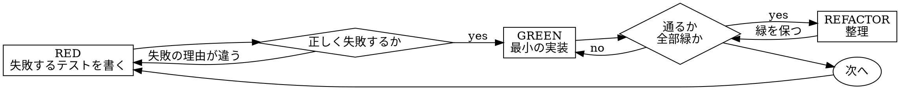

{{ includeTemplate (printf "agent-skills/_runtime/%s.md" .tool) . }}

# Test-Driven Development

## 概要

先にテストを書く。失敗するのを見る。通す最小限のコードを書く。

**中核**: テストが失敗するのを見ていないなら、それが正しいものをテストしているか分からない。

**この規則の字面を破ることは、この規則の精神を破ることである。**

## いつ使うか

**常に**:

- 新機能
- バグ修正
- リファクタリング
- 挙動の変更

**例外（ユーザーに確認する）**:

- 捨てるプロトタイプ
- 生成コード
- 設定ファイル

「今回だけ TDD を飛ばす」と思ったら、そこで止まる。それが正当化である。

## 鉄則

```
失敗するテスト無しに実装コードを書かない
```

テストより先にコードを書いてしまったら、**消す。やり直す。**

**例外なし**:

- 「参考として残す」をしない
- 書きながら「流用する」をしない
- 見ない
- 消すとは消すこと

テストから新規に実装する。以上。

## Red-Green-Refactor



### RED — 失敗するテストを書く

何が起きるべきかを示す最小のテストを 1 本書く。

<Good>
```typescript
test('失敗した操作を 3 回まで再試行する', async () => {
  let attempts = 0;
  const operation = () => {
    attempts++;
    if (attempts < 3) throw new Error('fail');
    return 'success';
  };

  const result = await retryOperation(operation);

  expect(result).toBe('success');
  expect(attempts).toBe(3);
});
```
名前が明確、実際の振る舞いをテストしている、1 つのことだけ見ている
</Good>

<Bad>
```typescript
test('retry works', async () => {
  const mock = jest.fn()
    .mockRejectedValueOnce(new Error())
    .mockRejectedValueOnce(new Error())
    .mockResolvedValueOnce('success');
  await retryOperation(mock);
  expect(mock).toHaveBeenCalledTimes(3);
});
```
名前が曖昧、コードではなく mock をテストしている
</Bad>

**条件**:

- 1 つの振る舞い
- 明確な名前
- 実際のコード（mock は避けられないときだけ）

### Verify RED — 失敗を目で見る

**必須。飛ばさない。**

```bash
npm test path/to/test.test.ts
```

確認すること:

- テストが**失敗**する（エラーで落ちるのではなく）
- 失敗メッセージが期待どおり
- 機能が無いから失敗している（typo が原因ではない）

**テストが通ってしまう場合**: 既存の振る舞いをテストしている。テストを直す。

**エラーで落ちる場合**: エラーを直し、正しく失敗するまで回す。

### GREEN — 最小のコード

テストを通す最も単純なコードを書く。

<Good>
```typescript
async function retryOperation<T>(fn: () => Promise<T>): Promise<T> {
  for (let i = 0; i < 3; i++) {
    try {
      return await fn();
    } catch (e) {
      if (i === 2) throw e;
    }
  }
  throw new Error('unreachable');
}
```
通すのにちょうど足りる
</Good>

<Bad>
```typescript
async function retryOperation<T>(
  fn: () => Promise<T>,
  options?: {
    maxRetries?: number;
    backoff?: 'linear' | 'exponential';
    onRetry?: (attempt: number) => void;
  }
): Promise<T> {
  // YAGNI
}
```
作りすぎ
</Bad>

機能を足さない。他のコードをリファクタリングしない。テストが求める以上に「良く」しない。

### Verify GREEN — 通ることを目で見る

**必須。**

```bash
npm test path/to/test.test.ts
```

確認すること:

- テストが通る
- 他のテストも通ったまま
- 出力がきれい（エラーも警告も出ていない）

**テストが落ちる場合**: テストではなくコードを直す。

**他のテストが落ちる場合**: 今直す。

### REFACTOR — 整理する

緑になってからだけ:

- 重複を除く
- 名前を改善する
- ヘルパーを抽出する

緑を保つ。振る舞いを足さない。

### 繰り返す

次の機能のための次の失敗するテストを書く。

## 良いテスト

| 観点 | Good | Bad |
|---|---|---|
| **最小** | 1 つのこと。名前に「and」が入るなら分ける | `test('メールとドメインと空白を検証する')` |
| **明確** | 名前が振る舞いを説明する | `test('test1')` |
| **意図を示す** | 望ましい API を体現している | コードが何をすべきか分からない |

テストを書く・変更するときは [writing-good-tests.md](writing-good-tests.md) を読む。テストを誠実に保つための規則が入っている。

- テストを書く前に、そのテストを失敗させる実装変更を名指しする
- mock の振る舞いではなく実際の振る舞いを assert する
- テスト専用のコードはテストユーティリティに置き、実装クラスに入れない
- 依存を mock する前に、その副作用を把握する

## よくある言い訳

| 言い訳 | 実際 |
|---|---|
| 「単純すぎてテストは要らない」 | 単純なコードも壊れる。テストは 30 秒で書ける |
| 「あとでテストする」 | 後から書いたテストは最初から通る。それは何も証明しない。間違ったものをテストしているかもしれないし、振る舞いではなく実装をテストしているかもしれないし、忘れていたエッジケースは埋まらない。失敗を見ていないので、バグを捕まえられる証拠が無い。test-first はその失敗を強制する |
| 「後から書いても目的は同じ（形式より精神）」 | 後から書くテストは「これは何をするか」に答える。先に書くテストは「これは何をすべきか」に答える。後から書くテストは既に書いたコードに引きずられ、思い出したケースだけを検証する |
| 「もう手で動かして確認した」 | 手動確認は場当たりである。何を確認したかの記録が無く、変更時に回し直せず、追い詰められると忘れる。「やってみたら動いた」は網羅ではない |
| 「X 時間分を消すのはもったいない」 | 埋没費用である。その時間はどちらにせよ消えている。選ぶのは「TDD で書き直す（確信が持てる）」か「残してテストを後付けする（確信が持てず、たいていバグが残る）」かである |
| 「参考に残してテストを先に書く」 | 流用する。それは後から書くのと同じ。消すとは消すこと |
| 「まず探索が要る」 | よい。探索は捨てて、TDD で始める |
| 「テストが書きにくい＝設計が不明瞭」 | テストの言い分を聞く。テストしにくいものは使いにくい |
| 「TDD は遅くなる」 | TDD が現実的な道である。コミット前にバグを捕まえ、リグレッションを防ぎ、恐れずにリファクタリングできる。「現実的」な近道は本番でのデバッグを意味する |
| 「既存コードにテストが無い」 | あなたが改善している。既存コードにもテストを足す |

## 赤信号 — 止まってやり直す

- テストより先にコードを書いた
- 実装の後にテストを書いた
- テストが最初から通った
- なぜテストが失敗したか説明できない
- テストを「あとで」追加した
- 「今回だけ」と正当化している
- 「もう手で確認した」
- 「後から書いても目的は同じ」
- 「形式ではなく精神の問題だ」
- 「参考に残す」「既存コードを流用する」
- 「もう X 時間かけた。消すのはもったいない」
- 「TDD は教条的だ。自分は現実的にやっている」
- 「これは事情が違う。なぜなら…」

**どれも意味は同じ: コードを消す。TDD でやり直す。**

## 例: バグ修正

**バグ**: 空のメールアドレスが受理される

**RED**
```typescript
test('空のメールアドレスを拒否する', async () => {
  const result = await submitForm({ email: '' });
  expect(result.error).toBe('Email required');
});
```

**Verify RED**
```bash
$ npm test
FAIL: expected 'Email required', got undefined
```

**GREEN**
```typescript
function submitForm(data: FormData) {
  if (!data.email?.trim()) {
    return { error: 'Email required' };
  }
  // ...
}
```

**Verify GREEN**
```bash
$ npm test
PASS
```

**REFACTOR**
複数フィールドの検証が要るならバリデーションを抽出する。

## 完了前のチェックリスト

- [ ] 新しい関数・メソッドすべてにテストがある
- [ ] 各テストが失敗するのを実装前に見た
- [ ] 各テストが期待どおりの理由で失敗した（typo ではなく機能が無いため）
- [ ] 各テストを通す最小のコードを書いた
- [ ] 全テストが通る
- [ ] 出力がきれい（エラーも警告も無い）
- [ ] テストは実際のコードを使っている（mock は避けられないときだけ）
- [ ] エッジケースとエラーを覆っている

全部にチェックが付かないなら TDD を飛ばしている。やり直す。

## 詰まったとき

| 問題 | 対処 |
|---|---|
| テスト方法が分からない | 欲しい API を書く。assert から書く。ユーザーに聞く |
| テストが複雑すぎる | 設計が複雑すぎる。インターフェースを単純にする |
| 全部 mock しないと書けない | 結合が強すぎる。依存性注入を使う |
| セットアップが巨大 | ヘルパーを抽出する。それでも複雑なら設計を単純にする |

## デバッグとの接続

バグを見つけたら、それを再現する失敗するテストを書く。TDD のサイクルを回す。テストが修正を証明し、リグレッションを防ぐ。

**テスト無しにバグを直さない。**

## 最終ルール

```
実装コード → 対応するテストが存在し、先に失敗した
それ以外 → TDD ではない
```

ユーザーの許可なしに例外は無い。
