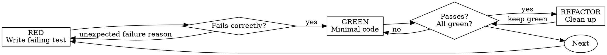

{{ includeTemplate (printf "agent-skills/_runtime/%s.md" .tool) . }}

# Test-Driven Development

## Overview

Write tests first. Watch them fail. Write minimal code to pass.

**Core**: If you haven't seen a test fail, you don't know if it's testing the right thing.

**Breaking the letter of this rule breaks the spirit of this rule.**

## When to Use

**Always**:
- New features
- Bug fixes
- Refactoring
- Behavioral changes

**Exceptions (confirm with user)**:
- Throwaway prototypes
- Generated code
- Configuration files

The moment you think "skip TDD just this once", stop right there. That is a rationalization.

## Iron Rule

```
Never write implementation code without a failing test
```

If code was written before tests: **Delete it. Start over.**

**No exceptions**:
- Do not "keep it as reference"
- Do not "reuse parts while writing"
- Do not look at it
- Deleting means deleting

Implement anew from tests. Period.

## Red-Green-Refactor



### RED — Write a Failing Test

Write one minimal test demonstrating what should happen.

<Good>
```typescript
test('retries failed operations up to 3 times', async () => {
  let attempts = 0;
  const operation = () => {
    attempts++;
    if (attempts < 3) throw new Error('fail');
    return 'success';
  };

  const result = await retryOperation(operation);

  expect(result).toBe('success');
  expect(attempts).toBe(3);
});
```
Clear name, tests real behavior, focuses on one thing
</Good>

<Bad>
```typescript
test('retry works', async () => {
  const mock = jest.fn()
    .mockRejectedValueOnce(new Error())
    .mockRejectedValueOnce(new Error())
    .mockResolvedValueOnce('success');
  await retryOperation(mock);
  expect(mock).toHaveBeenCalledTimes(3);
});
```
Vague name, tests the mock instead of the code
</Bad>

**Requirements**:
- Single behavior
- Clear name
- Real code (mocks only when unavoidable)

### Verify RED — Visually Confirm Failure

**Mandatory. Do not skip.**

```bash
npm test path/to/test.test.ts
```

Check:
- Test **fails** (not crashes with error)
- Failure message matches expectation
- Fails because feature is missing (not due to typos)

**If test passes**: You are testing existing behavior. Fix the test.

**If it crashes with an error**: Fix the error until it fails cleanly.

### GREEN — Minimal Implementation

Write the simplest code that passes the test.

<Good>
```typescript
async function retryOperation<T>(fn: () => Promise<T>): Promise<T> {
  for (let i = 0; i < 3; i++) {
    try {
      return await fn();
    } catch (e) {
      if (i === 2) throw e;
    }
  }
  throw new Error('unreachable');
}
```
Just enough to pass
</Good>

<Bad>
```typescript
async function retryOperation<T>(
  fn: () => Promise<T>,
  options?: {
    maxRetries?: number;
    backoff?: 'linear' | 'exponential';
    onRetry?: (attempt: number) => void;
  }
): Promise<T> {
  // YAGNI
}
```
Over-engineered
</Bad>

Do not add extra features. Do not refactor other code. Do not make it "better" than the test demands.

### Verify GREEN — Visually Confirm Passage

**Mandatory.**

```bash
npm test path/to/test.test.ts
```

Check:
- Test passes
- Other tests remain passing
- Clean output (no errors or warnings)

**If test fails**: Fix the implementation, not the test.

**If other tests break**: Fix them now.

### REFACTOR — Clean Up

Only after green:
- Remove duplication
- Improve naming
- Extract helpers

Keep tests green. Do not add new behavior.

### Repeat

Write the next failing test for the next capability.

## Good Tests

| Dimension | Good | Bad |
|---|---|---|
| **Minimal** | One thing. Split if name contains "and" | `test('validates email and domain and whitespace')` |
| **Clear** | Name describes behavior | `test('test1')` |
| **Intentional** | Exemplifies desired API | Unclear what code is supposed to do |

When writing or modifying tests, consult [writing-good-tests.md](writing-good-tests.md) for testing discipline:
- Name the implementation change that should cause failure before writing tests
- Assert real behavior rather than mock presence
- Place test-only helpers in test utilities, never on implementation classes
- Understand all side effects before mocking dependencies

## Common Rationalizations

| Rationalization | Reality |
|---|---|
| "Too simple to test" | Simple code breaks too. Tests take 30 seconds |
| "I'll test later" | Tests written later pass immediately, proving nothing. You might test the wrong thing or test implementation instead of behavior. Without seeing it fail, there is no proof it catches bugs. Test-first enforces failure |
| "Testing later has the same goal" | Tests written later answer "what does this do?" Tests written first answer "what should this do?" Later tests are biased by existing code |
| "I already verified manually" | Manual verification is ephemeral. Leaves no artifact, cannot re-run on changes, forgotten under stress. "Works for me once" is not coverage |
| "Wasteful to delete X hours of work" | Sunk cost fallacy. That time is gone either way. Choose: "Rewrite with TDD (high confidence)" vs. "Retrofit tests (low confidence, bugs linger)" |
| "Keep as reference while testing first" | You will copy-paste it. That is the same as writing tests after. Deleting means deleting |
| "Need exploration first" | Fine. Discard the spike, then begin TDD cleanly |
| "Hard to test = unclear design" | Listen to the test. Hard to test means hard to use |
| "TDD slows me down" | TDD is the pragmatic path: catches bugs before commit, prevents regressions, enables fearless refactoring. "Pragmatic" shortcuts mean debugging in production |
| "Existing code lacks tests" | You are improving it. Add tests to existing code too |

## Red Flags — Stop and Restart

- Wrote code before test
- Wrote test after implementation
- Test passed immediately on first run
- Cannot explain why test failed
- Added tests "later"
- Rationalizing "just this once"
- "Already tested manually"
- "Same outcome either way"
- "Matter of spirit, not dogma"
- "Keep as reference / reuse existing code"
- "Already spent hours; wasteful to delete"
- "TDD is too dogmatic; I am pragmatic"
- "My situation is different because..."

**All of these mean the same thing: Delete code. Restart with TDD.**

## Example: Bug Fix

**Bug**: Empty email address is accepted

**RED**
```typescript
test('rejects empty email address', async () => {
  const result = await submitForm({ email: '' });
  expect(result.error).toBe('Email required');
});
```

**Verify RED**
```bash
$ npm test
FAIL: expected 'Email required', got undefined
```

**GREEN**
```typescript
function submitForm(data: FormData) {
  if (!data.email?.trim()) {
    return { error: 'Email required' };
  }
  // ...
}
```

**Verify GREEN**
```bash
$ npm test
PASS
```

**REFACTOR**
Extract validator if multi-field validation is needed.

## Completion Checklist

- [ ] Every new function/method has tests
- [ ] Saw each test fail before implementing
- [ ] Each test failed for expected reason (missing feature, not typos)
- [ ] Wrote minimal code to pass each test
- [ ] All tests pass
- [ ] Clean output (no errors or warnings)
- [ ] Tests use real code (mocks only when unavoidable)
- [ ] Covered edge cases and errors

If not all checked, TDD was skipped. Start over.

## When Stuck

| Problem | Remedy |
|---|---|
| Don't know how to test | Write the desired API call. Start from assertions. Ask user |
| Test is too complicated | Design is too complicated. Simplify interface |
| Must mock everything | Coupling is too tight. Use dependency injection |
| Setup is gigantic | Extract helpers. If still complex, simplify design |

## Connection to Debugging

When a bug is found, write a failing test reproducing it. Follow the TDD cycle. Tests prove the fix and prevent regressions.

**Never fix a bug without a test.**

## Final Rule

```
Implementation code -> Corresponding test exists and failed first
Anything else -> Not TDD
```

No exceptions without user permission.
