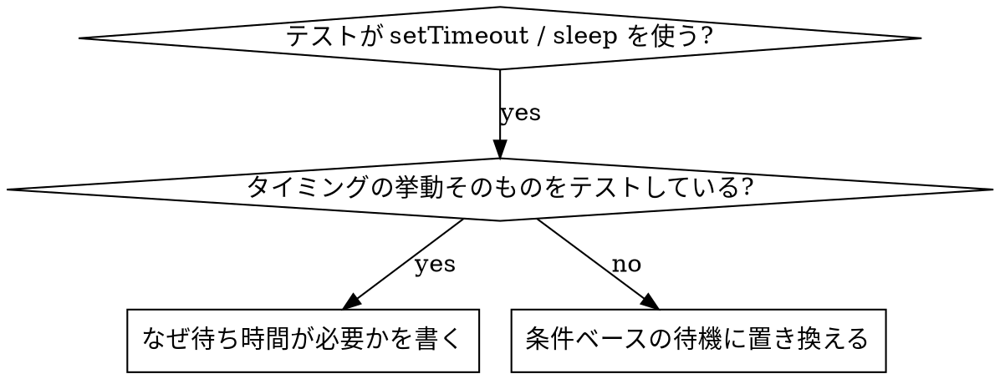

# Condition-Based Waiting

## 概要

不安定なテストは、しばしば任意の待ち時間でタイミングを推測している。これは競合状態を作り、速いマシンでは通り、負荷時や CI では落ちる。

**中核**: どれだけ掛かるかの推測ではなく、本当に気にしている条件を待つ。

## いつ使うか



**使うとき**:

- テストに任意の待ち時間がある（`setTimeout`、`sleep`、`time.sleep()`）
- テストが不安定（通るときと落ちるときがある、負荷時に落ちる）
- 並列実行するとタイムアウトする
- 非同期処理の完了を待っている

**使わないとき**:

- タイミングの挙動そのものをテストしている（debounce、throttle の間隔）
- 任意の待ち時間を使う場合は、必ず理由をコメントに書く

## 基本形

```typescript
// ❌ 前: タイミングを推測している
await new Promise(r => setTimeout(r, 50));
const result = getResult();
expect(result).toBeDefined();

// ✅ 後: 条件を待っている
await waitFor(() => getResult() !== undefined);
const result = getResult();
expect(result).toBeDefined();
```

## パターン

| 場面 | 書き方 |
|---|---|
| イベントを待つ | `waitFor(() => events.find(e => e.type === 'DONE'))` |
| 状態を待つ | `waitFor(() => machine.state === 'ready')` |
| 件数を待つ | `waitFor(() => items.length >= 5)` |
| ファイルを待つ | `waitFor(() => fs.existsSync(path))` |
| 複合条件 | `waitFor(() => obj.ready && obj.value > 10)` |

## 実装

汎用のポーリング関数:

```typescript
async function waitFor<T>(
  condition: () => T | undefined | null | false,
  description: string,
  timeoutMs = 5000
): Promise<T> {
  const startTime = Date.now();

  while (true) {
    const result = condition();
    if (result) return result;

    if (Date.now() - startTime > timeoutMs) {
      throw new Error(`Timeout waiting for ${description} after ${timeoutMs}ms`);
    }

    await new Promise(r => setTimeout(r, 10)); // 10ms ごとにポーリング
  }
}
```

## よくある誤り

**❌ ポーリングが速すぎる**: `setTimeout(check, 1)` は CPU を浪費する
**✅ 対処**: 10ms ごとにする

**❌ タイムアウトが無い**: 条件が満たされないと無限ループする
**✅ 対処**: 必ずタイムアウトと明確なエラーを入れる

**❌ 古いデータを見ている**: ループの前に状態をキャッシュしている
**✅ 対処**: ループの中で getter を呼び、毎回新しい値を取る

## 任意の待ち時間が正しい場合

```typescript
// ツールは 100ms ごとに tick する。部分出力の確認には 2 tick 必要
await waitForEvent(manager, 'TOOL_STARTED'); // まず条件を待つ
await new Promise(r => setTimeout(r, 200));   // そのうえで時間依存の挙動を待つ
// 200ms = 100ms 間隔で 2 tick。根拠を明示している
```

**条件**:

1. まず引き金となる条件を待つ
2. 推測ではなく既知のタイミングに基づく
3. なぜその値かをコメントに書く
