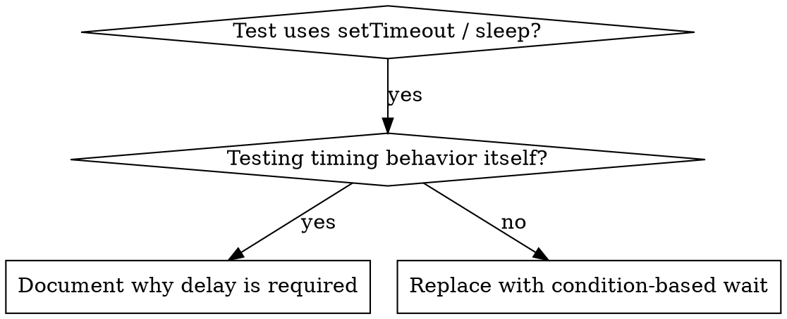

# Condition-Based Waiting

## Overview

Flaky tests frequently guess timing using arbitrary delays. This introduces race conditions: passing on fast hardware, but failing under load or in CI.

**Core**: Instead of guessing duration, wait for the actual condition of interest.

## When to Use



**Use when**:

- Tests include arbitrary sleep/wait calls (`setTimeout`, `sleep`, `time.sleep()`)
- Tests are flaky (intermittent passes/failures, failures under system load)
- Tests timeout during concurrent/parallel execution
- Waiting for asynchronous operations to complete

**Do NOT use when**:

- The test specifically evaluates timing behavior itself (debounce intervals, throttle delays)
- When arbitrary wait is genuinely required, always document the reason in a comment

## Basic Pattern

```typescript
// ❌ Before: Guessing timing
await new Promise(r => setTimeout(r, 50));
const result = getResult();
expect(result).toBeDefined();

// ✅ After: Waiting for condition
await waitFor(() => getResult() !== undefined);
const result = getResult();
expect(result).toBeDefined();
```

## Patterns

| Scenario | Syntax |
|---|---|
| Waiting for an event | `waitFor(() => events.find(e => e.type === 'DONE'))` |
| Waiting for state change | `waitFor(() => machine.state === 'ready')` |
| Waiting for count | `waitFor(() => items.length >= 5)` |
| Waiting for a file | `waitFor(() => fs.existsSync(path))` |
| Compound condition | `waitFor(() => obj.ready && obj.value > 10)` |

## Implementation

Generic polling utility:

```typescript
async function waitFor<T>(
  condition: () => T | undefined | null | false,
  description: string,
  timeoutMs = 5000
): Promise<T> {
  const startTime = Date.now();

  while (true) {
    const result = condition();
    if (result) return result;

    if (Date.now() - startTime > timeoutMs) {
      throw new Error(`Timeout waiting for ${description} after ${timeoutMs}ms`);
    }

    await new Promise(r => setTimeout(r, 10)); // Poll every 10ms
  }
}
```

## Common Mistakes

**❌ Polling too fast**: `setTimeout(check, 1)` consumes excessive CPU
**✅ Fix**: Poll every 10ms

**❌ Missing timeout**: Infinite loops occur if conditions are never met
**✅ Fix**: Always include a timeout with an explicit error message

**❌ Checking stale data**: Caching state before the loop starts
**✅ Fix**: Call getters inside the loop body to fetch fresh state on every iteration

## When Arbitrary Waiting is Correct

```typescript
// Tool ticks every 100ms; inspecting partial output requires 2 ticks
await waitForEvent(manager, 'TOOL_STARTED'); // Wait for precondition first
await new Promise(r => setTimeout(r, 200));   // Intentional timing check
```
