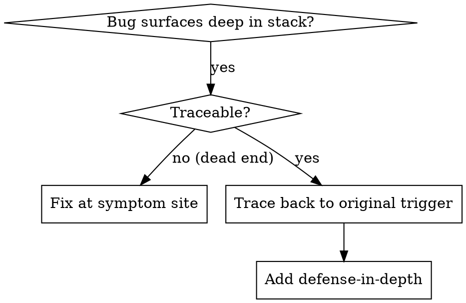
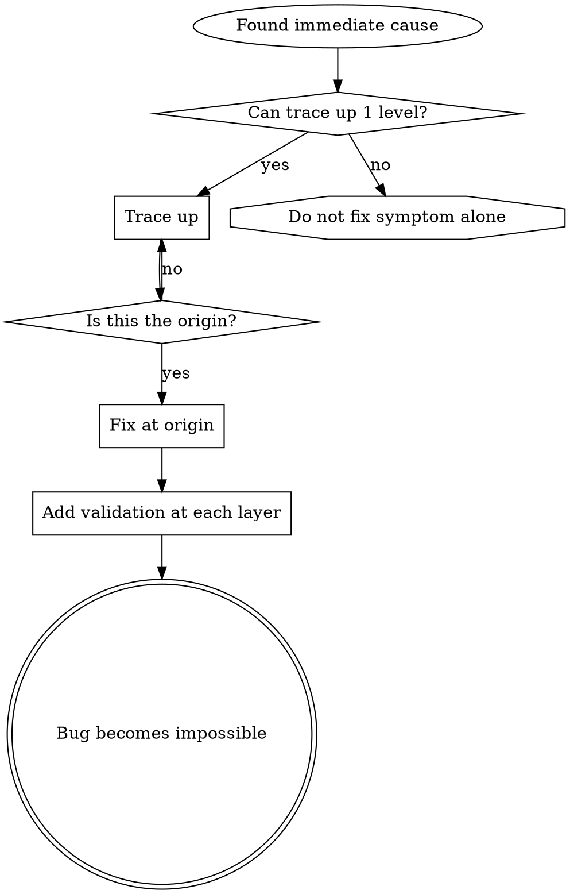

# Root Cause Tracing

## Overview

Bugs often surface deep in call stacks (e.g., `git init` running in the wrong directory, files created in unexpected locations, database opening on an invalid path). The temptation is to fix the problem where the error appears, but that merely treats the symptom.

**Core**: Trace backward up the chain of calls to find the original trigger, and fix it there.

## When to Use



**Use when**:

- Errors occur deep inside execution rather than at the entrypoint
- Stack traces show a long chain of calls
- Unclear where invalid data originated
- Identifying which test or caller triggers the problem

## How to Trace Backward

### 1. Observe the Symptom

```
Error: git init failed in ~/project/packages/core
```

### 2. Find the Immediate Cause

**Which code directly triggered this?**

```typescript
await execFileAsync('git', ['init'], { cwd: projectDir });
```

### 3. Ask "Who Called This?"

```
WorktreeManager.createSessionWorktree(projectDir, sessionId)
  <- Session.initializeWorkspace()
  <- Session.create()
  <- Project.create() in test
```

### 4. Continue Tracing Upward

**What value was passed?**

- `projectDir = ''` (empty string)
- Passing an empty string to `cwd` resolves to `process.cwd()`
- That was the source code directory

### 5. Locate the Original Trigger

**Where did the empty string come from?**

```typescript
const context = setupCoreTest(); // Returns { tempDir: '' }
Project.create('name', context.tempDir); // Accessed before beforeEach
```

## Instrumenting Stack Traces

When tracing manually is impractical, add instrumentation:

```typescript
async function gitInit(directory: string) {
  const stack = new Error().stack;
  console.error('DEBUG git init:', {
    directory,
    cwd: process.cwd(),
    nodeEnv: process.env.NODE_ENV,
    stack,
  });

  await execFileAsync('git', ['init'], { cwd: directory });
}
```

**Important**: Use `console.error()` in tests (loggers may be silenced).

Execute and capture:

```bash
npm test 2>&1 | grep 'DEBUG git init'
```

Reading stack traces:
- Look for test file names
- Identify the line number initiating the call
- Identify patterns (same test? same arguments?)

## Finding the Polluting Test

If an unwanted artifact appears during test suite execution but the source test is unknown, run tests one by one and stop at the first polluter (bisection):

```bash
for f in $(git ls-files 'src/**/*.test.ts'); do
  rm -rf .git-probe && npm test -- "$f" >/dev/null 2>&1
  if [ -e '.git' ]; then echo "polluter: $f"; break; fi
done
```

## Real Example: Empty projectDir

**Symptom**: `.git` created inside `packages/core/` (source code directory)

**Trace chain**:
1. `git init` ran in `process.cwd()` <- `cwd` argument was empty
2. `WorktreeManager` called with empty `projectDir`
3. `Session.create()` passed an empty string
4. Test accessed `context.tempDir` before `beforeEach` ran
5. `setupCoreTest()` initially returned `{ tempDir: '' }`

**Root Cause**: Top-level variable initialization accessed an uninitialized value

**Fix**: Converted `tempDir` into a getter that throws if accessed before `beforeEach`

**Add Defense-in-Depth**:
- Layer 1: `Project.create()` validates directory
- Layer 2: `WorkspaceManager` validates non-empty directory
- Layer 3: Refuse `git init` outside tmpdir during tests
- Layer 4: Record stack trace before running `git init`

## Principle



**Never patch only where the error surfaces.** Trace back to the original trigger.

## Stack Trace Tips

- **In tests**: Use `console.error()` rather than loggers, which may be suppressed.
- **Before the action**: Record before dangerous operations, not after failure.
- **Include context**: Directory, cwd, environment variables, timestamps.
- **Capture full stack**: `new Error().stack` reveals the complete invocation chain.
