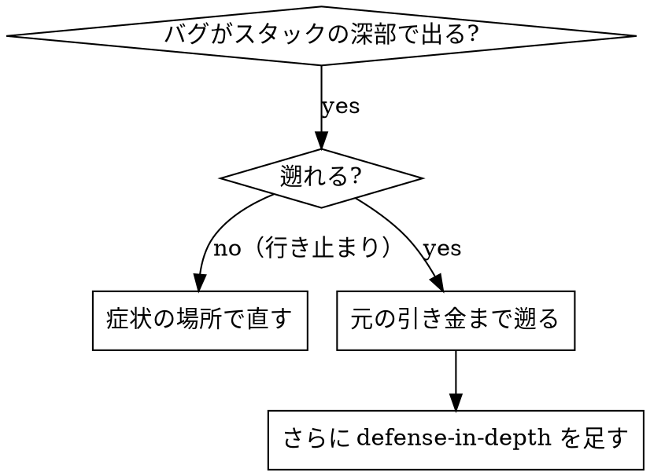
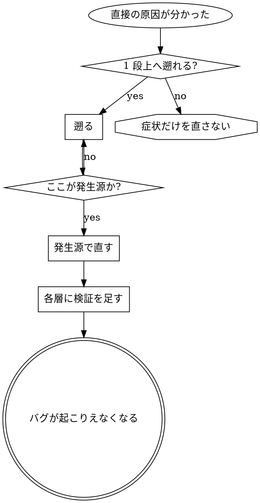

# Root Cause Tracing

## 概要

バグはコールスタックの深いところで表面化することが多い（間違ったディレクトリで git init が走る、間違った場所にファイルができる、間違ったパスで DB が開く）。エラーが出た場所で直したくなるが、それは症状への対処である。

**中核**: 呼び出しの連鎖を遡って元の引き金に行き着き、そこで直す。

## いつ使うか



**使うとき**:

- エラーが実行の深いところで起きる（入口ではない）
- スタックトレースが長い呼び出し連鎖を示している
- 不正なデータがどこで生まれたか分からない
- どのテスト・どのコードが問題を引き起こしているか特定したい

## 遡り方

### 1. 症状を観察する

```
Error: git init failed in ~/project/packages/core
```

### 2. 直接の原因を見つける

**どのコードがこれを直接引き起こしているか**

```typescript
await execFileAsync('git', ['init'], { cwd: projectDir });
```

### 3. 「これを呼んだのは誰か」を問う

```
WorktreeManager.createSessionWorktree(projectDir, sessionId)
  ← Session.initializeWorkspace()
  ← Session.create()
  ← test の Project.create()
```

### 4. 上へ遡り続ける

**どんな値が渡されたか**

- `projectDir = ''`（空文字列）
- 空文字列を `cwd` に渡すと `process.cwd()` に解決される
- それはソースコードのディレクトリだった

### 5. 元の引き金を見つける

**空文字列はどこから来たか**

```typescript
const context = setupCoreTest(); // { tempDir: '' } を返す
Project.create('name', context.tempDir); // beforeEach より前にアクセスしていた
```

## スタックトレースを仕込む

手で追えないときは計測を入れる。

```typescript
async function gitInit(directory: string) {
  const stack = new Error().stack;
  console.error('DEBUG git init:', {
    directory,
    cwd: process.cwd(),
    nodeEnv: process.env.NODE_ENV,
    stack,
  });

  await execFileAsync('git', ['init'], { cwd: directory });
}
```

**重要**: テストでは `console.error()` を使う（logger は出ないことがある）。

実行して拾う:

```bash
npm test 2>&1 | grep 'DEBUG git init'
```

スタックトレースの読み方:

- テストファイル名を探す
- 呼び出しを引き起こした行番号を見つける
- パターンを特定する（同じテストか。同じ引数か）

## どのテストが汚染しているか

テスト中に何かが現れるがどのテストか分からない場合は、テストを 1 本ずつ実行して最初に汚染したところで止める（bisection）。

```bash
for f in $(git ls-files 'src/**/*.test.ts'); do
  rm -rf .git-probe && npm test -- "$f" >/dev/null 2>&1
  if [ -e '.git' ]; then echo "polluter: $f"; break; fi
done
```

## 実例: 空の projectDir

**症状**: `packages/core/`（ソースコード）に `.git` ができる

**遡りの連鎖**:

1. `git init` が `process.cwd()` で走る ← cwd 引数が空
2. WorktreeManager が空の projectDir で呼ばれた
3. `Session.create()` が空文字列を渡した
4. テストが beforeEach より前に `context.tempDir` にアクセスした
5. `setupCoreTest()` は初期状態で `{ tempDir: '' }` を返す

**根本原因**: トップレベル変数の初期化が空の値にアクセスしていた

**修正**: `tempDir` を getter にして、beforeEach より前のアクセスで throw させた

**さらに defense-in-depth を追加**:

- 層 1: `Project.create()` がディレクトリを検証する
- 層 2: `WorkspaceManager` が空でないことを検証する
- 層 3: テスト中は tmpdir 外での git init を拒否する
- 層 4: git init 前にスタックトレースを記録する

## 原則



**エラーが出た場所だけを直さない。** 元の引き金まで遡る。

## スタックトレースのこつ

- **テストでは**: logger ではなく `console.error()` を使う。logger は抑制されることがある
- **操作の前に**: 失敗した後ではなく、危険な操作の前に記録する
- **文脈を含める**: ディレクトリ、cwd、環境変数、タイムスタンプ
- **スタックを取る**: `new Error().stack` で呼び出し連鎖全体が見える
